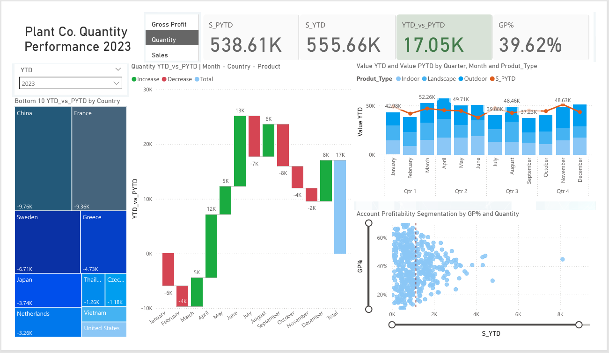
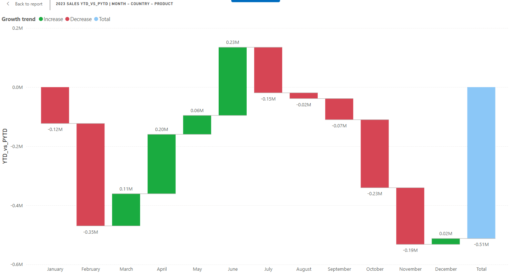
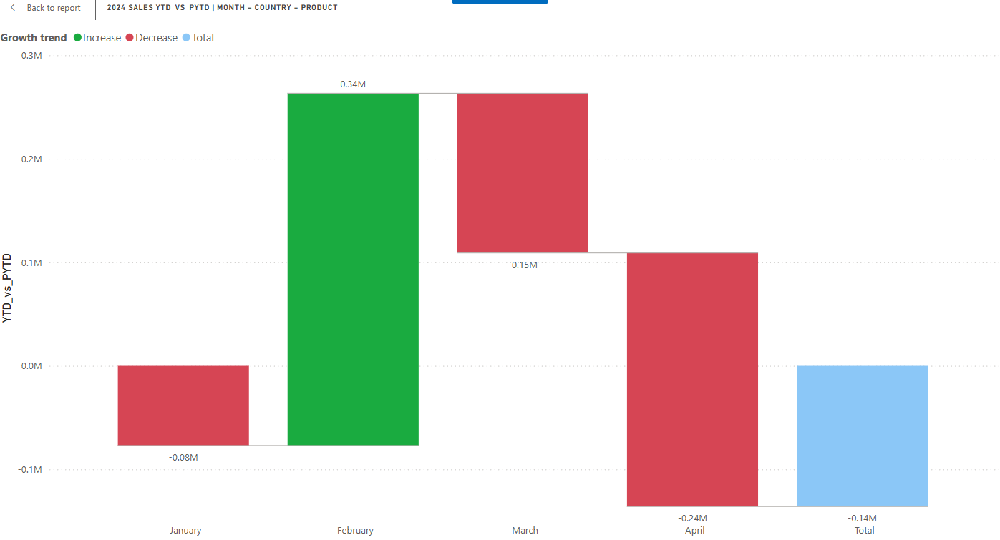
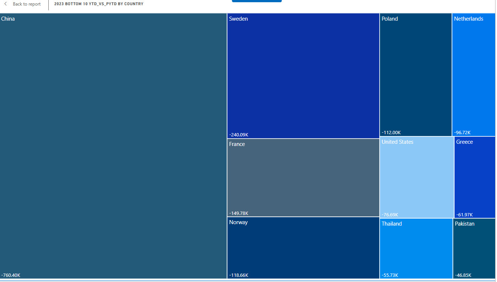
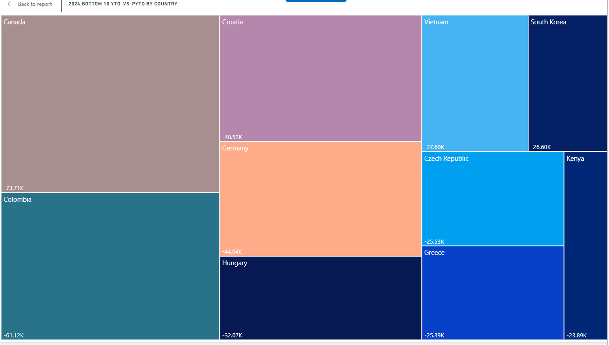

# Plant Co. Sales, Quantity and Profit Performance Dashboard (2023)

## 📊 Project Overview
This Power BI dashboard tracks the **Quantity Performance** of Plant Co. for the year 2023. It provides insights into:
- Sales growth trends (YTD vs PYTD).
- Country-wise performance breakdown.
- Monthly fluctuations in sales.
- Profitability segmentation.

## 📌 Key Metrics
- **S_PYTD (Sales Previous Year-to-Date):** 
- **S_YTD (Sales Year-to-Date):** 
- **YTD_vs_PYTD:** 
- **Gross Profit % (GP%):** 

## 📊 Dashboard Components
### **1. Performance Summary**
#### **Key Performance Indicators (KPIs):**
These KPIs indicate a negative sales trend compared to the previous year, with an increase in total sales and gross profit percentage.

#### **📈 Sales Growth Comparison (2023 vs 2024)**
Below is a comparative visualization of sales performance in 2023 and 2024.

#### **Sales Growth Comparison (2023 vs 2024)**

    

        <h4>2023 Sales Performance</h4>
        
    

    

        <h4>2024 Sales Performance</h4>
        
    

##### **Observations:**
- **2023 Sales:** Showed steady growth in the first quarter of the year with an upward trajectory.
- **2024 Sales:** Experienced fluctuations, with a notable increase in **February**, but losses in **January, March, and April** led to an overall decline of **-0.14M** in YTD vs PYTD.
- **Key Takeaway:** Despite positive gains in specific months, the overall sales trend in 2024 highlights potential challenges that need further analysis, such as market conditions or product performance.

### **2. Bottom 10 Countries by YTD_vs_PYTD**
- Shows the worst-performing countries.  
- **China (-760.40K)** for the year 2023 and **Canada (-73.71K)** for year 2024 are the lowest.

    

        <h4>2023 worst-performing countries</h4>
        
    

    

        <h4>2024 worst-performing countries</h4>
        
    

### **3. Value YTD vs PYTD by Quarter**
- Compares different product types (Indoor, Landscape, Outdoor).

### **4. Account Profitability (Scatter Plot)**
- Plots GP% vs Quantity to analyze profitability distribution.

## 🛠️ Tech Stack
- **Power BI**
- **DAX & Power Query**
- **Excel/CSV (Data Sources)**

